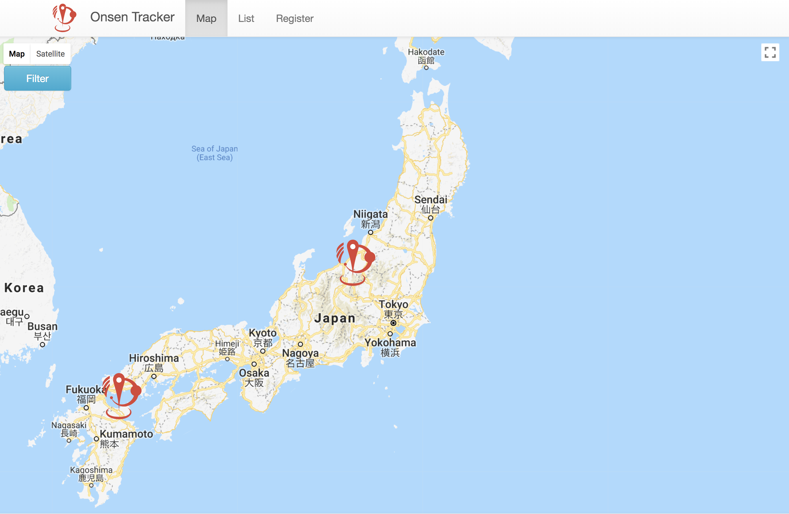

# Onsen Tracker

If you love onsens, this application is highly recommnended. This application can record the places of onsens and
show them with a marker.



## Get Started

---

## Prerequisites

Node.js >= 9.5.0

## 1.Installing

```unix
git clone https://github.com/maaaashin324/cc3-project.polyglottal.git
cd cc3-project.polyglottal
yarn install
```

## 2.Creating DATA BASE

```unix
psql
CREATE DATABASE onsen;
```

## 3.Creating tables and seeding dummy data

```unix
go run db/migrations/*.go up
```

## 3-1.Re-creating

```unix
go run db/migrations/*.go reset
go run db/migrations/*.go up
```

## 4.Running this application with development mode

You need two consoles.

In one console

```unix
yarn watch
```

In the other console

```unix
yarn start
```

==> You can see this application on [localhost](http://localhost:3000/)

## Built with

---

### Frontend

* React
* Redux
* React-Router
* React-Bootstrap
* webpack
* babel

### Backend

* dep
* Iris
* go/pg
* postgreSQL
* Heroku